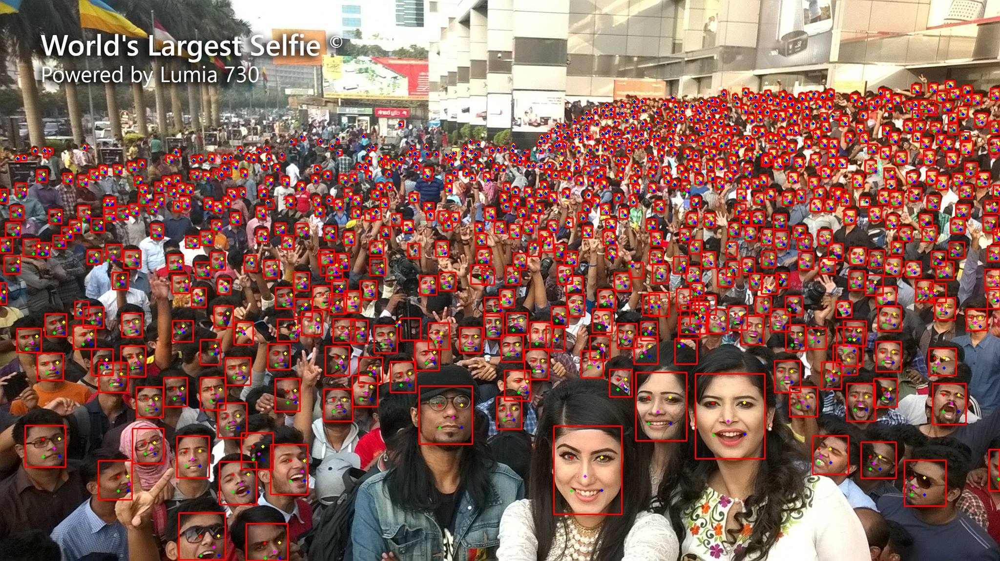

# YOLOV5_Face
基于pytorch的Yolov5人脸检测

## 性能效果
| Backbone| easy | medium | hard |
|:-|:-:|:-:|:-:|
| CSPdarknet-s | 94.58% | 93.37% | 82.84% |

## 预训练模型
+ 基于cspdarknet_s的人脸检测模型yolov5_face。<br>
>- 链接: https://pan.baidu.com/s/1Gm4m7DNbSmmbyQ43NZHojA 
>- 提取码：il9n

## 训练
### 1. 下载数据集并放置在Data下
>- 链接: https://drive.google.com/open?id=11UGV3nbVv1x9IC--_tK3Uxf7hA6rlbsS

### 2. 开始训练
``` bash
python train.py
```
## 测试图片
修改utils/utils_yoloface.py文件中的model_path指向训练好的模型。
在predict.py文件下输入图片路径，运行：
``` bash
python predict.py
```
## widerface 数据集测试
修改utils/utils_yoloface.py文件中的model_path指向训练好的模型。
``` bash
python test_widerface.py
```
``` bash
cd ./widerface_evaluate
python setup.py build_ext --inplace
python evaluation.py
```
## 人脸检测示意图
<br>
## Reference
- https://github.com/biubug6/Pytorch_Retinaface
- https://github.com/bubbliiiing/yolov5-pytorch

